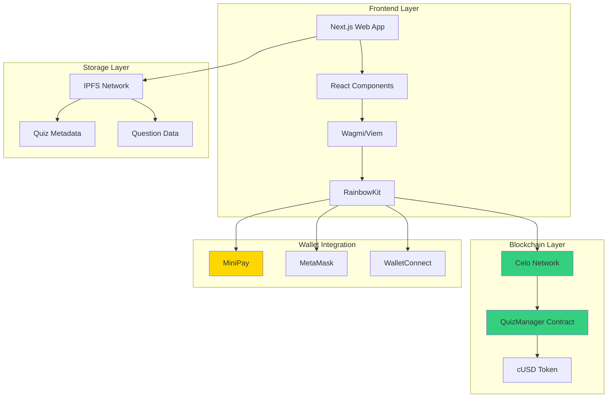
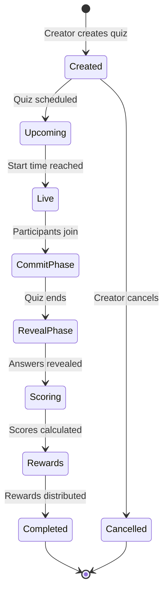
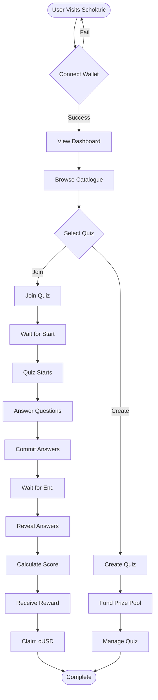
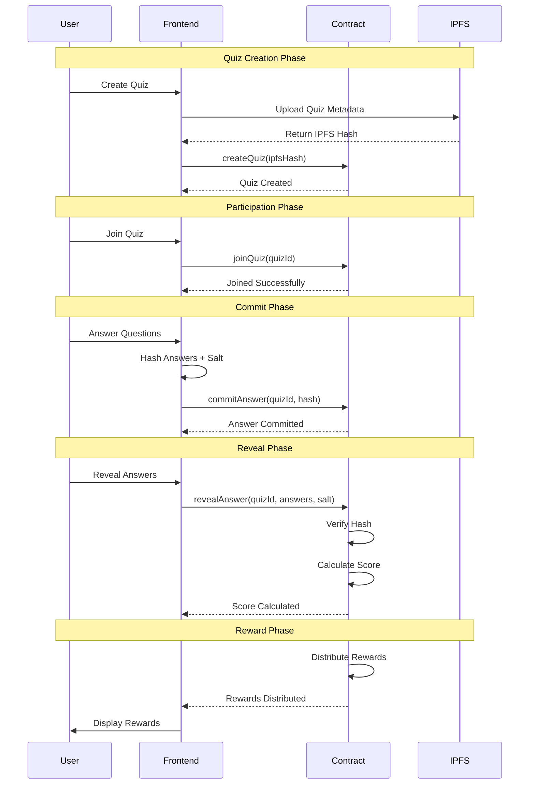
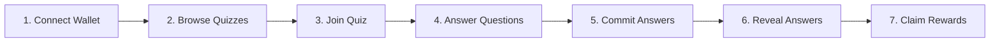
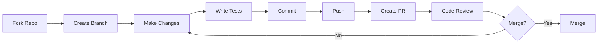

# Scholaric

<div align="center">

**Learn & Earn with Blockchain-Powered Education**

[](https://opensource.org/licenses/MIT)
[](https://celo.org)
[](https://minipay.celo.org)

[Live Demo](#) • [Documentation](#) • [Report Bug](https://github.com/adamstosho/Scholaric/issues) • [Request Feature](https://github.com/adamstosho/Scholaric/issues)

</div>

---

## ✅ **TESTED AND VERIFIED ON MINIPAY**

**This application has been fully tested and verified to work seamlessly with MiniPay!** The app has been tested using the MiniPay Mini App Test tool with ngrok tunneling, ensuring complete compatibility with MiniPay's mobile wallet environment. All features including wallet connection, quiz creation, participation, and cUSD transactions have been verified to work perfectly on MiniPay.

---

## 📸 Testing Page on Minipay App


---

## 📖 Table of Contents

- [Overview](#-overview)
- [Features](#-key-features)
- [Architecture](#-system-architecture)
- [Getting Started](#-getting-started)
- [User Guide](#-how-to-use)
- [Technical Documentation](#-technical-documentation)
- [Smart Contracts](#-smart-contracts)
- [Deployment](#-deployment)
- [Contributing](#-contributing)
- [Support](#-support)

---

## 🎯 Overview

Scholaric is a decentralized educational platform built on the Celo blockchain that rewards learners with cUSD (Celo Dollars) for answering quiz questions correctly. Create educational quizzes, fund prize pools, and earn real cryptocurrency rewards while learning.

**Built for the Celo MiniPay Hackathon** - Educational Games category.

### What is Scholaric?

Scholaric is a learn-to-earn platform that combines education with blockchain technology. Students can participate in quizzes on various subjects, answer questions correctly, and earn cUSD rewards. Teachers and content creators can create quizzes, fund prize pools, and build engaging educational experiences.

The platform uses smart contracts on the Celo blockchain to ensure transparent, fair, and secure reward distribution. All quiz data is stored on IPFS (InterPlanetary File System) for decentralization and permanence.

### 🎥 Demo Video

**CHECK OUT THE APP DEMO HERE** (Kindly click on the below image to see the video)

[](https://youtu.be/9X8sPOnXlBA)

---

## 🔍 Problem Statement

Traditional education platforms face several challenges:

| Challenge | Impact | Solution |
|-----------|--------|----------|
| **Lack of Motivation** | Low student engagement | Financial incentives via cUSD rewards |
| **Limited Accessibility** | High costs exclude many students | Free access with blockchain rewards |
| **No Transparency** | Opaque reward systems | On-chain transparent reward distribution |
| **High Transaction Costs** | Expensive micro-payments | Low-cost Celo blockchain transactions |
| **Geographic Barriers** | Currency and payment restrictions | Global access via cryptocurrency |

---

## 💡 Solution

Scholaric solves these problems through:

- ✅ **Blockchain Rewards**: Students earn cUSD (stable cryptocurrency) for correct answers, providing real financial motivation
- ✅ **Transparent System**: All quiz results and rewards are recorded on the blockchain, ensuring fairness
- ✅ **Low-Cost Transactions**: Built on Celo blockchain with MiniPay support for gas-free transactions
- ✅ **Global Access**: Anyone with a crypto wallet can participate, regardless of location
- ✅ **Decentralized Storage**: Quiz content stored on IPFS ensures permanence and accessibility
- ✅ **Fair Distribution**: Smart contracts automatically distribute rewards based on performance

---

## 📸 Application Screenshots

### Landing Page


### User Dashboard


### Quiz Catalogue


### Quiz Filtering

**DO YOU KNOW YOU CAN ALSO FILTER THE QUIZZES HERE FOR BEST UX...**


### Leaderboard


### Rewards Page


---

## ✨ Key Features

### For Learners

| Feature | Description | Benefit |
|---------|-------------|---------|
| **Browse Quizzes** | Explore a catalogue of educational quizzes on various subjects | Easy discovery of learning opportunities |
| **Join Quizzes** | Participate in active quizzes by connecting your wallet | Simple onboarding process |
| **Answer Questions** | Submit answers using a secure commit-reveal pattern | Prevents cheating and ensures fairness |
| **Earn Rewards** | Receive cUSD rewards based on your quiz performance | Financial motivation to learn |
| **View Leaderboards** | See how you rank compared to other participants | Gamification and competition |
| **Track Rewards** | Monitor your earnings and reward history | Transparent reward tracking |

### For Creators

| Feature | Description | Benefit |
|---------|-------------|---------|
| **Create Quizzes** | Build custom quizzes with multiple-choice, true/false, or short-answer questions | Flexible content creation |
| **Fund Prize Pools** | Add cUSD to quiz prize pools to incentivize participation | Control over reward amounts |
| **Manage Quizzes** | Set quiz duration, maximum participants, and start times | Full control over quiz parameters |
| **View Analytics** | Track quiz participation and performance metrics | Data-driven insights |

### Platform Features

1. **Secure Commit-Reveal**: Answers are committed as hashes first, then revealed after the quiz ends, preventing cheating
2. **Proportional Rewards**: Rewards are distributed proportionally based on scores
3. **IPFS Storage**: Quiz metadata stored on decentralized IPFS network
4. **MiniPay Integration**: ✅ **Fully tested and verified** - Seamless wallet connection with MiniPay support, tested using MiniPay Mini App Test tool
5. **Mobile-First Design**: Responsive design optimized for mobile devices
6. **Real-Time Updates**: Live updates on quiz status and participant counts

---

## 🏗️ System Architecture

### High-Level Architecture Diagram



### Quiz Lifecycle Flow



### User Journey Flow



### Commit-Reveal Pattern Flow



---

## 🛠️ Tech Stack

### Technology Stack Table

| Category | Technology | Version | Purpose |
|----------|-----------|---------|---------|
| **Frontend Framework** | Next.js | 14 | React framework with App Router |
| **Language** | TypeScript | 5.2+ | Type-safe JavaScript |
| **Styling** | Tailwind CSS | Latest | Utility-first CSS framework |
| **UI Components** | shadcn/ui | Latest | Accessible component library |
| **State Management** | TanStack Query | Latest | Server state management |
| **Blockchain Library** | Wagmi | v2 | React hooks for Ethereum |
| **Blockchain Utilities** | Viem | v2 | TypeScript Ethereum library |
| **Wallet Connection** | RainbowKit | Latest | Wallet connection UI |
| **Form Handling** | React Hook Form | Latest | Performant forms |
| **Validation** | Zod | Latest | Schema validation |
| **Icons** | Lucide React | Latest | Icon library |
| **Blockchain** | Celo | Mainnet | Proof-of-stake blockchain |
| **Smart Contracts** | Solidity | 0.8.20 | Smart contract language |
| **Development** | Hardhat | Latest | Ethereum development environment |
| **Storage** | IPFS | - | Decentralized storage |
| **Monorepo** | Turborepo | Latest | Build system |
| **Package Manager** | pnpm | 8.0+ | Fast package manager |
| **Deployment** | Vercel | - | Frontend hosting |

### Frontend Architecture

```
Frontend Stack:
├── Next.js 14 (App Router)
│   ├── Server Components
│   ├── Client Components
│   └── API Routes
├── TypeScript
│   └── Type Safety
├── Tailwind CSS
│   └── Utility-first Styling
├── shadcn/ui
│   └── Radix UI Components
└── State Management
    ├── React Query (Server State)
    └── React Context (Client State)
```

### Blockchain Integration

```
Blockchain Stack:
├── Wagmi v2
│   └── React Hooks for Ethereum
├── Viem v2
│   └── TypeScript Ethereum Library
├── RainbowKit
│   └── Wallet Connection UI
└── Celo Network
    ├── Mainnet (Production)
    └── Testnets (Development)
```

---

## 🚀 Getting Started

### Prerequisites

| Requirement | Version | Purpose |
|-------------|---------|---------|
| **Node.js** | ≥18.0.0 | JavaScript runtime |
| **pnpm** | ≥8.0.0 | Package manager |
| **Git** | Latest | Version control |
| **Crypto Wallet** | - | MetaMask, WalletConnect, or MiniPay |

### Installation Steps

#### 1. Clone the Repository

```bash
git clone https://github.com/adamstosho/Scholaric.git
cd Scholaric
```

#### 2. Install Dependencies

```bash
pnpm install
```

#### 3. Set Up Environment Variables

Create a `.env.local` file in the `apps/web` directory:

```bash
cd apps/web
cp .env.example .env.local
```

Fill in the required environment variables (see [Environment Variables](#-environment-variables) section).

#### 4. Start Development Server

```bash
# From the root directory
pnpm dev
```

The app will be available at `http://localhost:3000`

### Smart Contracts Setup

#### 1. Navigate to Contracts Directory

```bash
cd apps/contracts
```

#### 2. Set Up Environment Variables

Create a `.env` file:

```env
PRIVATE_KEY=your_private_key_here
CELOSCAN_API_KEY=your_celoscan_api_key  # optional
```

#### 3. Compile Contracts

```bash
pnpm compile
```

#### 4. Run Tests

```bash
pnpm test
```

#### 5. Deploy to Testnet (Optional)

```bash
pnpm deploy:sepolia
# OR
pnpm deploy:alfajores
```

---

## 📱 How to Use

### User Journey Guide

#### For First-Time Users



**Step-by-Step Instructions:**

1. **Connect Your Wallet**
   - Click the "Connect Wallet" button on the homepage
   - Choose your wallet (MetaMask, WalletConnect, or MiniPay)
   - Approve the connection request
   - You'll be redirected to your dashboard

2. **Browse Available Quizzes**
   - Click "Catalogue" in the navigation menu
   - Browse through available quizzes
   - Use filters to find quizzes by subject, difficulty, or status
   - Each quiz shows:
     - Subject and difficulty level
     - Prize pool amount
     - Number of participants
     - Start time and duration

3. **Join a Quiz**
   - Click on a quiz you want to join
   - Review the quiz details
   - Click "Join Quiz" button
   - Confirm the transaction in your wallet
   - Wait for the quiz to start

4. **Take the Quiz**
   - Once the quiz starts, you'll see the questions
   - Select your answers for each question
   - Click "Commit Answers" to submit (answers are hashed for security)
   - Wait for the quiz to end

5. **Reveal Your Answers**
   - After the quiz ends, click "Reveal Answers"
   - Your score will be calculated automatically
   - Rewards will be distributed based on your performance

6. **Claim Your Rewards**
   - Go to the "Rewards" page
   - View your earned rewards
   - Click "Claim" to receive cUSD in your wallet

#### For Quiz Creators

**Step-by-Step Instructions:**

1. **Create a New Quiz**
   - Click "Create Quiz" in the navigation menu
   - Fill in the quiz details:
     - Title and description
     - Subject and difficulty
     - Grade level
     - Start time and duration
     - Maximum number of participants
   - Add questions:
     - Question text
     - Answer options (for multiple choice)
     - Correct answer
   - Click "Create Quiz"
   - Confirm the transaction

2. **Fund the Prize Pool**
   - After creating a quiz, you can add funds to the prize pool
   - Click "Fund Quiz" on the quiz page
   - Enter the amount of cUSD you want to add
   - Confirm the transaction
   - The prize pool will be updated

3. **Manage Your Quiz**
   - View quiz statistics on your dashboard
   - Monitor participant count
   - End the quiz early if needed (only creator can do this)

### Navigation Guide

| Page | Description | Access |
|------|-------------|--------|
| **Home** | Landing page with features and information | `/` |
| **Catalogue** | Browse all available quizzes | `/catalogue` |
| **Dashboard** | Your personal dashboard with quiz history | `/dashboard` |
| **Create** | Create a new quiz | `/create` |
| **Leaderboard** | View top performers across all quizzes | `/leaderboard` |
| **Rewards** | View and claim your earned rewards | `/rewards` |

---

## 📁 Project Structure

```
Scholaric/
├── apps/
│   ├── web/                      # Next.js frontend application
│   │   ├── src/
│   │   │   ├── app/              # Next.js app router pages
│   │   │   │   ├── catalogue/    # Quiz catalogue page
│   │   │   │   ├── create/       # Quiz creation page
│   │   │   │   ├── dashboard/    # User dashboard
│   │   │   │   ├── leaderboard/  # Leaderboard page
│   │   │   │   ├── quiz/         # Quiz pages (join, session, results)
│   │   │   │   └── rewards/      # Rewards page
│   │   │   ├── components/       # React components
│   │   │   │   ├── ui/           # shadcn/ui components
│   │   │   │   └── ...           # Custom components
│   │   │   ├── hooks/            # Custom React hooks
│   │   │   ├── lib/              # Utility functions and contracts
│   │   │   │   ├── contracts/    # Contract ABIs and addresses
│   │   │   │   └── utils/        # Helper functions
│   │   │   └── styles/           # Global styles
│   │   ├── public/               # Static assets
│   │   └── package.json
│   │
│   └── contracts/                # Smart contracts
│       ├── contracts/             # Solidity contract files
│       │   ├── QuizManager.sol   # Main contract
│       │   └── libraries/        # Contract libraries
│       ├── test/                 # Contract tests
│       ├── scripts/              # Deployment scripts
│       └── hardhat.config.ts     # Hardhat configuration
│
├── package.json                  # Root package.json
├── turbo.json                    # Turborepo configuration
├── pnpm-workspace.yaml           # pnpm workspace config
└── README.md                     # This file
```

---

## 🔐 Smart Contracts

### QuizManager Contract

The main smart contract that handles all quiz operations on the Celo blockchain.

#### Contract Information

| Property | Value |
|----------|-------|
| **Network** | Celo Mainnet |
| **Address** | `0x1469beF9638eE24Bdb39835fD3429D45F7833827` |
| **Explorer** | [View on Celoscan](https://celoscan.io/address/0x1469beF9638eE24Bdb39835fD3429D45F7833827) |
| **Solidity Version** | 0.8.20 |
| **License** | MIT |

#### Contract Functions

| Function | Description | Access Control |
|----------|-------------|----------------|
| `createQuiz()` | Create a new quiz with metadata | Public |
| `fundQuiz()` | Add funds to a quiz prize pool | Public |
| `joinQuiz()` | Join an active quiz | Public |
| `commitAnswer()` | Submit answer hash (commit phase) | Participant only |
| `revealAnswer()` | Reveal answers and calculate score | Participant only |
| `distributeRewards()` | Distribute rewards to participants | Public |
| `endQuiz()` | End a quiz early | Creator only |
| `cancelQuiz()` | Cancel a quiz and refund participants | Creator only |
| `pause()` | Pause contract operations | Owner only |
| `unpause()` | Unpause contract operations | Owner only |

#### Security Features

| Feature | Description |
|---------|-------------|
| **Commit-Reveal Pattern** | Prevents cheating by hiding answers until quiz ends |
| **Access Control** | Only quiz creators can end or cancel their quizzes |
| **Pausable** | Contract can be paused by owner in case of emergencies |
| **Reentrancy Protection** | Protected against reentrancy attacks using OpenZeppelin's ReentrancyGuard |
| **Ownable** | Contract ownership for administrative functions |

#### Smart Contract Interaction Flow

```mermaid
sequenceDiagram
    participant Creator
    participant Participant
    participant Contract
    participant IPFS
    
    Creator->>IPFS: Upload Quiz Metadata
    IPFS-->>Creator: Return IPFS Hash
    Creator->>Contract: createQuiz(ipfsHash, params)
    Contract-->>Creator: Quiz Created (Event)
    
    Creator->>Contract: fundQuiz(quizId, amount)
    Contract-->>Creator: Prize Pool Funded
    
    Participant->>Contract: joinQuiz(quizId)
    Contract-->>Participant: Joined Successfully
    
    Participant->>Contract: commitAnswer(quizId, hash)
    Contract-->>Participant: Answer Committed
    
    Note over Contract: Quiz Ends
    
    Participant->>Contract: revealAnswer(quizId, answers, salt)
    Contract->>Contract: Verify & Calculate Score
    Contract-->>Participant: Score Calculated
    
    Contract->>Contract: distributeRewards(quizId)
    Contract-->>Participant: Rewards Distributed
```

---

## 🔑 Environment Variables

### Frontend Environment Variables (`apps/web/.env.local`)

#### Required Variables

| Variable | Description | Example |
|----------|-------------|---------|
| `NEXT_PUBLIC_QUIZ_MANAGER_ADDRESS` | Smart contract address on Celo | `0x1469beF9638eE24Bdb39835fD3429D45F7833827` |
| `NEXT_PUBLIC_CHAIN_ID` | Celo network chain ID | `42220` (Mainnet) |
| `NEXT_PUBLIC_NETWORK_NAME` | Network name | `Celo Mainnet` |
| `NEXT_PUBLIC_EXPLORER_URL` | Block explorer URL | `https://celoscan.io` |
| `NEXT_PUBLIC_WEB3_STORAGE_TOKEN` | Web3.Storage API token | `eyJhbGciOiJIUzI1NiIsInR5cCI6IkpXVCJ9...` |
| `NEXT_PUBLIC_IPFS_GATEWAY` | IPFS gateway URL | `https://ipfs.io/ipfs/` |

#### Optional Variables

| Variable | Description | Example |
|----------|-------------|---------|
| `NEXT_PUBLIC_WC_PROJECT_ID` | WalletConnect Project ID | `your_project_id` |
| `NEXT_PUBLIC_PINATA_JWT_TOKEN` | Pinata JWT token (alternative to Web3.Storage) | `eyJhbGciOiJIUzI1NiIsInR5cCI6IkpXVCJ9...` |
| `NEXT_PUBLIC_APP_NAME` | Application name | `Scholaric` |
| `NEXT_PUBLIC_APP_URL` | Application URL | `http://localhost:3000` |
| `NEXT_PUBLIC_ENV` | Environment | `development` or `production` |

### Smart Contracts Environment Variables (`apps/contracts/.env`)

| Variable | Description | Required |
|----------|-------------|----------|
| `PRIVATE_KEY` | Private key for contract deployment | Yes |
| `CELOSCAN_API_KEY` | Celoscan API key for contract verification | No |

### Getting API Keys

#### 1. Web3.Storage Token

1. Visit [web3.storage](https://web3.storage/)
2. Sign up for a free account
3. Create an API token
4. Copy and paste into `NEXT_PUBLIC_WEB3_STORAGE_TOKEN`

#### 2. WalletConnect Project ID

1. Visit [cloud.walletconnect.com](https://cloud.walletconnect.com/)
2. Create a new project
3. Copy the Project ID
4. Paste into `NEXT_PUBLIC_WC_PROJECT_ID`

#### 3. Pinata JWT Token (Alternative)

1. Visit [pinata.cloud](https://pinata.cloud/)
2. Sign up for an account
3. Generate a JWT token
4. Paste into `NEXT_PUBLIC_PINATA_JWT_TOKEN`

---

## 🚀 Deployment

### Deployment Checklist

| Step | Task | Status |
|------|------|--------|
| 1 | Set up environment variables | ⬜ |
| 2 | Deploy smart contracts | ⬜ |
| 3 | Verify smart contracts | ⬜ |
| 4 | Update frontend contract address | ⬜ |
| 5 | Deploy frontend | ⬜ |
| 6 | Test all features | ⬜ |
| 7 | Update documentation | ⬜ |

### Frontend Deployment (Vercel)

#### Step 1: Push Code to GitHub

```bash
git push origin main
```

#### Step 2: Import to Vercel

1. Go to [vercel.com](https://vercel.com)
2. Click "Add New Project"
3. Import your GitHub repository
4. Set **Root Directory** to `apps/web`
5. Add all environment variables
6. Click "Deploy"

#### Step 3: Configure Settings

| Setting | Value |
|---------|-------|
| Framework | Next.js (auto-detected) |
| Build Command | `pnpm build` |
| Install Command | `pnpm install` |
| Root Directory | `apps/web` |

### Smart Contract Deployment

#### Deploy to Celo Mainnet

```bash
cd apps/contracts
pnpm deploy:celo
```

#### Verify Contract (Optional)

```bash
pnpm verify --network celo
```

#### Update Frontend

1. Update `NEXT_PUBLIC_QUIZ_MANAGER_ADDRESS` in `.env.local` with the new contract address
2. Ensure `NEXT_PUBLIC_CHAIN_ID=42220` for mainnet

#### Testnet Deployment

For testnet deployments, use:

```bash
# Celo Alfajores Testnet
pnpm deploy:alfajores

# Celo Sepolia Testnet
pnpm deploy:sepolia
```

---

## 🧪 Testing

### Frontend Testing

```bash
# Run linting
pnpm lint

# Type checking
pnpm type-check

# Build for production
pnpm build
```

### Smart Contract Testing

```bash
cd apps/contracts

# Run all tests
pnpm test

# Run tests with coverage
pnpm test --coverage

# Run specific test file
pnpm test test/QuizManager.test.ts
```

### Test Coverage Goals

| Component | Target Coverage |
|-----------|----------------|
| Smart Contracts | ≥90% |
| Frontend Components | ≥80% |
| Utility Functions | ≥85% |

---

## 🤝 Contributing

We welcome contributions! Please follow these steps:

### Contribution Process

1. **Fork the repository**
   ```bash
   git clone https://github.com/your-username/Scholaric.git
   ```

2. **Create a feature branch**
   ```bash
   git checkout -b feature/amazing-feature
   ```

3. **Make your changes**
   - Write clean, documented code
   - Add tests for new features
   - Update documentation as needed

4. **Commit your changes**
   ```bash
   git commit -m 'Add some amazing feature'
   ```

5. **Push to the branch**
   ```bash
   git push origin feature/amazing-feature
   ```

6. **Open a Pull Request**
   - Provide a clear description
   - Reference any related issues
   - Wait for code review

### Code Style Guidelines

| Guideline | Description |
|-----------|-------------|
| **TypeScript** | Follow TypeScript best practices and use strict mode |
| **Formatting** | Use ESLint and Prettier for code formatting |
| **Commits** | Write meaningful commit messages following conventional commits |
| **Tests** | Add tests for new features and ensure existing tests pass |
| **Documentation** | Update README and code comments for new features |

### Development Workflow



---

## 📄 License

This project is licensed under the MIT License - see the [LICENSE](LICENSE) file for details.

---

## 🙏 Acknowledgments

- **Celo Foundation** for the blockchain infrastructure
- **Celo Africa DAO** for hosting the hackathon
- **MiniPay** for seamless mobile wallet integration
- **IPFS** for decentralized storage
- All open-source contributors whose libraries made this project possible

---

## 📞 Support

### Get Help

| Channel | Link |
|---------|------|
| **GitHub Issues** | [Create an issue](https://github.com/adamstosho/Scholaric/issues) |
| **Email** | omoridoh111@gmail.com |
| **Documentation** | See [Documentation](#) |

### Report a Bug

If you find a bug, please create an issue with:
- Description of the bug
- Steps to reproduce
- Expected behavior
- Actual behavior
- Screenshots (if applicable)

### Request a Feature

Have an idea? Create a feature request with:
- Description of the feature
- Use case
- Proposed implementation (optional)

---

## 🎯 Built for Celo MiniPay Hackathon

**✅ TESTED AND VERIFIED ON MINIPAY**

This application has been thoroughly tested using the MiniPay Mini App Test tool with ngrok tunneling. All core functionalities including wallet connection, quiz operations, and cUSD transactions have been verified to work seamlessly on MiniPay.

### Hackathon Details

- **Event**: Celo MiniPay Hackathon
- **Category**: Educational Games
- **Status**: ✅ Completed
- **Verification**: ✅ MiniPay Tested

---

<div align="center">

**Built with ❤️ for the Celo ecosystem**

[](https://celo.org)
[](https://minipay.celo.org)

</div>
